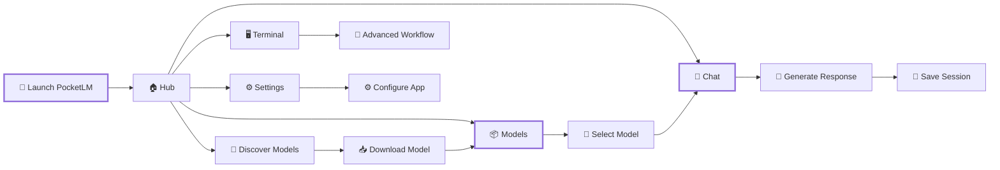
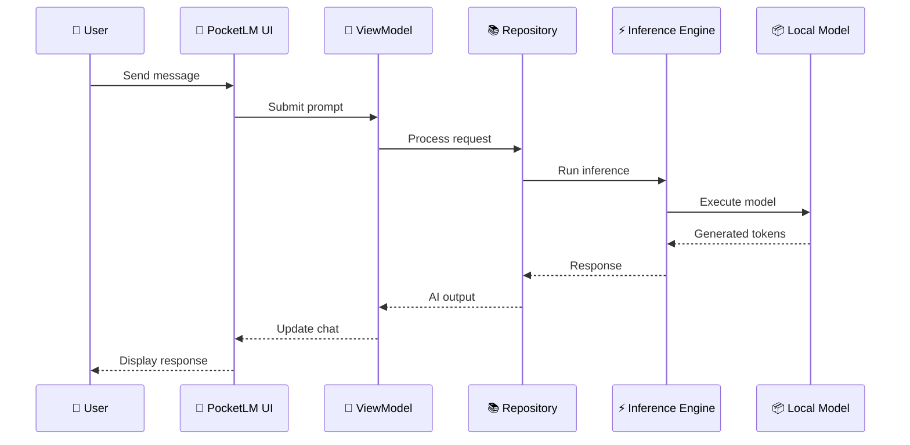

<div align="center">

# ⚡ PocketLM

### **Your AI. Your Device. Your Data.**

<p>
  <strong>A powerful Android LLM workspace for downloading, managing and interacting with Hugging Face models locally.</strong>
</p>

<br>

<a href="https://github.com/im-aswajith">
  
</a>
<a href="https://github.com/im-aswajith">
  
</a>


<br><br>


<br><br>

> **PocketLM brings the power of modern language models directly into your pocket.**

</div>

---

<div align="center">

### 🧠 **LOCAL AI • MODEL MANAGEMENT • CHAT • TERMINAL • TELEMETRY**

```text
       ┌─────────────────────────────────────────┐
       │              ⚡ PocketLM                │
       ├─────────────────────────────────────────┤
       │                                         │
       │   🤗 Hugging Face       📦 Models       │
       │          │                   │           │
       │          ▼                   ▼           │
       │      ┌─────────────────────────┐        │
       │      │      Local AI Engine     │        │
       │      └─────────────────────────┘        │
       │             │       │       │            │
       │             ▼       ▼       ▼            │
       │           💬 Chat  🖥️ CLI  📊 Stats     │
       │                                         │
       └─────────────────────────────────────────┘
```

</div>

---

## ✨ What is PocketLM?

**PocketLM** is an Android-first AI workspace designed around the idea of bringing capable language models closer to the user.

Instead of treating AI as something that always requires a browser or cloud service, PocketLM is designed to provide a dedicated environment for:

* 🤗 Discovering Hugging Face models
* 📥 Downloading models to the device
* 🧠 Running local AI workloads
* 💬 Maintaining AI chat sessions
* 🗂️ Managing downloaded models
* 🖥️ Working with a built-in terminal
* 📊 Monitoring device hardware
* 💾 Persisting conversations and model information
* ⚙️ Managing application settings

The goal is simple:

> **Put the AI workspace in your pocket.**

---

# 🚀 Core Features

<table>
<tr>
<td width="50%">

### 🤗 Hugging Face Hub

Discover and work with models from the Hugging Face ecosystem.

* Model discovery
* Model metadata
* Model management
* Download workflow
* Local model organization

</td>

<td width="50%">

### 💬 AI Chat

A dedicated conversational interface for interacting with your models.

* Persistent sessions
* Message history
* Thinking animation
* Clean Material UI
* Session management

</td>
</tr>

<tr>
<td>

### 📦 Model Manager

Keep your local models organized.

* Model cards
* Download progress
* Model state
* Local model information
* Model selection

</td>

<td>

### 🖥️ Terminal

A dedicated terminal-oriented workspace inside the application.

Useful for advanced workflows and experimentation.

</td>
</tr>

<tr>
<td>

### 📊 Hardware Telemetry

Monitor device resources while working with local AI.

* Hardware diagnostics
* Telemetry information
* Runtime monitoring
* Resource awareness

</td>

<td>

### 💾 Local Persistence

Powered by Android Room for structured local application data.

* Chat sessions
* Chat messages
* Model metadata
* Persistent application state

</td>
</tr>
</table>

---

# 🎬 Application Flow



---

# 🧩 Architecture

PocketLM follows a modular Android architecture separating UI, state management, repositories, local storage, networking and AI/runtime components.

```text
app/
│
├── data/
│   ├── local/
│   │   ├── AppDatabase
│   │   ├── ChatDao
│   │   ├── ChatMessageEntity
│   │   ├── ChatSessionEntity
│   │   ├── ModelDao
│   │   └── ModelEntity
│   │
│   ├── remote/
│   │   ├── HuggingFaceApi
│   │   ├── HfModelDto
│   │   ├── NetworkClient
│   │   └── GeminiClient
│   │
│   └── repository/
│       ├── ChatRepository
│       └── ModelRepository
│
├── engine/
│   ├── HardwareMonitor
│   └── InferenceEngine
│
├── ui/
│   ├── components/
│   ├── screens/
│   ├── theme/
│   └── viewmodel/
│
└── MainActivity.kt
```

---

# 🛠️ Technology Stack

<div align="center">

| Technology            | Purpose                         |
| --------------------- | ------------------------------- |
| **Kotlin**            | Primary programming language    |
| **Jetpack Compose**   | Modern Android UI               |
| **Material 3**        | Application design system       |
| **Room**              | Local database & persistence    |
| **Retrofit**          | Network communication           |
| **OkHttp**            | HTTP networking                 |
| **Moshi**             | JSON serialization              |
| **Kotlin Coroutines** | Asynchronous operations         |
| **Hugging Face API**  | Model discovery & metadata      |
| **Firebase AI**       | AI/cloud-assisted functionality |
| **KSP**               | Kotlin code generation          |
| **Robolectric**       | Testing                         |
| **Roborazzi**         | UI screenshot testing           |

</div>

---

# 📱 Navigation

PocketLM currently organizes its main experience into five areas:

```text
┌───────────────────────────────────────────────┐
│                  PocketLM                     │
├───────────────────────────────────────────────┤
│                                               │
│  ☁️ Hub                                       │
│     Model discovery & application overview    │
│                                               │
│  💬 Chat                                      │
│     Conversational AI workspace               │
│                                               │
│  📁 Models                                    │
│     Downloaded model management               │
│                                               │
│  >_ Terminal                                  │
│     Terminal-oriented workspace               │
│                                               │
│  ⚙️ Settings                                  │
│     Application configuration                 │
│                                               │
└───────────────────────────────────────────────┘
```

---

# ⚡ Getting Started

## Requirements

Before building PocketLM, make sure you have:

* Android Studio
* Android SDK
* JDK 11+
* Android device or emulator
* Internet connection for model/API operations
* Required environment configuration

The application currently targets Android SDK 36 and supports devices from API 24 onward.

---

## 📥 Clone the Repository

```bash
git clone https://github.com/im-aswajith/PocketLM.git

cd PocketLM
```

> Replace `PocketLM` with the repository name if the GitHub repository uses a different name.

---

## 🧰 Open in Android Studio

1. Open **Android Studio**
2. Select **Open**
3. Choose the PocketLM project directory
4. Allow Gradle synchronization to complete
5. Connect an Android device or start an emulator
6. Build and run the application

---

# 🔐 Environment Configuration

PocketLM uses environment-based configuration for sensitive values.

Create a `.env` file based on the provided example:

```bash
cp .env.example .env
```

Then configure the required values.

```env
GEMINI_API_KEY=your_api_key_here
```

### ⚠️ Security

**Never commit your real API keys to GitHub.**

Use:

```text
.env
```

for local secrets and:

```text
.env.example
```

for safe configuration templates.

---

# 🧠 AI Architecture



---

# 📊 Project Structure

```text
PocketLM
│
├── app/
│   ├── src/
│   │   ├── androidTest/
│   │   └── main/
│   │       ├── java/
│   │       │   └── com/example/
│   │       │
│   │       └── AndroidManifest.xml
│   │
│   ├── build.gradle.kts
│   └── proguard-rules.pro
│
├── .env.example
├── .gitignore
├── metadata.json
└── README.md
```

---

# 🎨 Design Philosophy

PocketLM is built around several principles:

### ⚡ Fast

Keep the interface responsive while long-running AI operations happen in the background.

### 🧩 Modular

Separate UI, repositories, storage, networking and AI/runtime components.

### 📱 Mobile First

The application is designed specifically around the Android experience.

### 🔒 Privacy Conscious

Local model workflows reduce the need to send every interaction to a remote service.

### 🛠️ Developer Friendly

The project includes structured data layers, repositories, ViewModels and testing infrastructure.

---

# 🧪 Testing

The project includes Android and JVM testing infrastructure.

Run the available Gradle checks with:

```bash
./gradlew test
```

For Android instrumentation tests:

```bash
./gradlew connectedAndroidTest
```

---

# 🗺️ Roadmap

```text
                         POCKETLM
                            │
          ┌─────────────────┼─────────────────┐
          ▼                 ▼                 ▼
      🧠 AI CORE         📦 MODELS         📱 UX
          │                 │                 │
          ├─ Runtime        ├─ Discovery      ├─ UI polish
          ├─ Optimization   ├─ Downloads      ├─ Animations
          └─ Performance    └─ Management     └─ Accessibility
                            │
                            ▼
                       🚀 FUTURE
```

Potential future improvements include:

* [ ] More local model formats
* [ ] Improved inference acceleration
* [ ] Advanced hardware optimization
* [ ] Better model filtering
* [ ] Model favorites
* [ ] Import/export conversations
* [ ] More advanced terminal functionality
* [ ] Improved offline capabilities
* [ ] Additional performance telemetry
* [ ] Expanded automated testing

---

# 🤝 Contributing

PocketLM is currently maintained by **Aswajith**.

If you discover a bug or have a feature request, please use the appropriate GitHub repository functionality.

### 🐛 Bug Reports

When reporting a bug, include:

```text
Device:
Android Version:
PocketLM Version:
Model:
Steps to Reproduce:
Expected Behavior:
Actual Behavior:
Logs / Screenshots:
```

### 💡 Feature Requests

Please explain:

1. What you would like to add
2. Why it would be useful
3. How you expect it to work
4. Any relevant examples

---

# ❤️ Thanks

A huge thank you to the projects and communities that make PocketLM possible.

### 🤗 Hugging Face

For building an incredible ecosystem for open machine learning models.

### 🟢 Android

For providing the platform and tooling that makes the mobile AI experience possible.

### 🟣 Kotlin

For making modern Android development expressive and productive.

### 🎨 Jetpack Compose

For enabling a modern declarative UI architecture.

### 🔥 Firebase

For providing useful infrastructure and AI-related capabilities.

### 👨‍💻 Open Source Community

For the libraries, tools, research and knowledge that continue to push local AI forward.

---

# 👨‍💻 Developer

<div align="center">

## Aswajith

**Android Developer • AI Enthusiast • Builder**

<a href="https://github.com/im-aswajith">
  
</a>

<a href="https://huggingface.co/noturaxwa">
  
</a>

<a href="https://www.linkedin.com/in/aswajith-raj/">
  
</a>

<br><br>

> Building tools that make AI more accessible, personal and powerful.

</div>

---

# ⭐ Support the Project

If PocketLM is useful to you:

<div align="center">

### ⭐ Star the repository

### 🐛 Report bugs

### 💡 Suggest improvements

### 📢 Share the project

</div>

Every bit of support helps the project grow.

---

# 📜 License

## PocketLM — Personal Use License

Copyright © 2026 **Aswajith / im-aswajith**

All rights reserved.

Permission is granted to download, install and **use the compiled PocketLM application for personal and non-commercial purposes**.

The following actions are **not permitted without explicit written permission from the copyright holder**:

* ❌ Modifying the source code
* ❌ Modifying, altering or repackaging the application
* ❌ Redistributing modified versions
* ❌ Publishing forks or modified builds
* ❌ Selling or commercially distributing the application
* ❌ Removing copyright or attribution notices
* ❌ Rebranding the application as another product
* ❌ Using the source code to create a substantially similar competing application
* ❌ Sublicensing the project or its source code

### Allowed

```text
✓ Download
✓ Install
✓ Run
✓ Personal use
✓ Educational use
✓ Evaluation
✓ Bug reporting
✓ Feature suggestions
```

### Not Allowed

```text
✗ Modify
✗ Repackage
✗ Redistribute modified builds
✗ Commercial redistribution
✗ Remove attribution
✗ Claim ownership
✗ Re-license
```

> **Important:** This is a custom proprietary license and is intentionally **not an OSI-approved open-source license**. If you want legally enforceable terms tailored to your jurisdiction, have the final license reviewed by a qualified lawyer.

---

# ⚖️ Third-Party Software

PocketLM may use third-party libraries and services that are distributed under their respective licenses.

Those licenses remain applicable to their respective components.

Nothing in this license grants ownership of third-party software, models, datasets, trademarks or services.

---

# 🤖 AI Model Notice

PocketLM may interact with models obtained through third-party ecosystems such as Hugging Face.

**Each model has its own license and usage restrictions.**

Before downloading, distributing or commercially using a model, check the model's individual license and terms.

PocketLM does not grant permission to redistribute third-party models.

---

# 🔒 Privacy & API Keys

Never expose private credentials in the repository.

Do **not** commit:

```text
.env
*.jks
*.keystore
google-services.json
private API keys
access tokens
```

Use environment variables or local configuration instead.

---

# 🌌 Final

<div align="center">

```text
╔══════════════════════════════════════════════╗
║                                              ║
║              ⚡  P O C K E T L M             ║
║                                              ║
║       LOCAL AI • MOBILE • PRIVATE           ║
║                                              ║
║           Your AI. Your Device.             ║
║              Your Workspace.                 ║
║                                              ║
╚══════════════════════════════════════════════╝
```

### Built with ❤️ and ☕ by **Aswajith**

<a href="https://github.com/im-aswajith">
  
</a>

<br><br>

**If you build something interesting with PocketLM, I'd love to see it. 🚀**

<br>

<sub>© 2026 Aswajith. All rights reserved.</sub>

</div>
